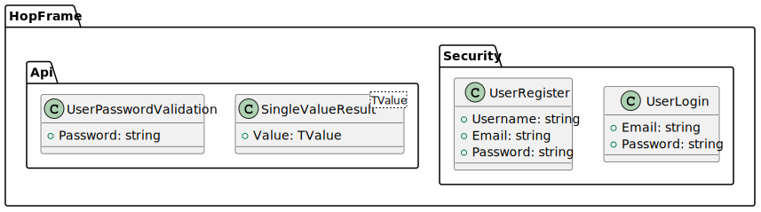
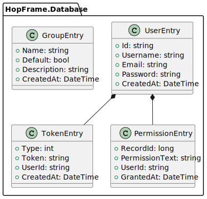

# Models for HopFrame

This page shows all models that HopFrame uses.

## Base Models
These are the models used by the various database services.

## API Models
These are the models used by the REST API and the Blazor API.

## Database Models
These are the models that correspond to the scheme in the Database

